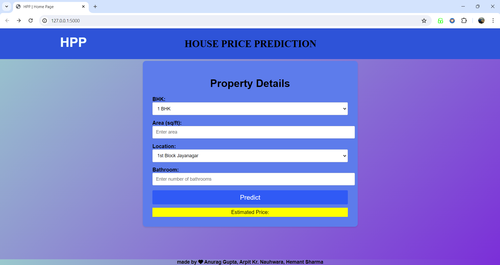

# House Price Predication Project

# Objective:
The primary objective of the House Price Analysis & Prediction project is to develop a robust and accurate machine learning model that can analyze and predict the prices of properties in Bangalore. We will first build a model using sklearn and linear regression using banglore home prices dataset from kaggle.com. Second step would be to write a python flask server that uses the saved model to serve http requests. Third component is the website built in html & css  that allows user to enter home square ft area, bedrooms etc and it will call python flask server to retrieve the predicted price. 
The specific objectives include: 
1. Data Collection, Exploration and Preprocessing.
2. Exploratory Data Analysis.
3. Feature Selection and Engineering.
4. Machine Learning Model Development.
5. Website Development

# Guide to our Project
<video src="media/HPP _ Home Page.mp4" contols autoplay height="400" width="800">

# Tools & Technologies Used:
1. Python
2. Numpy and Pandas for data cleaning
3. Matplotlib and Seaborn for data visualization
4. Sklearn for model building
5. Jupyter notebook and visual studio code as IDE
6. Python flask for http server
7. HTML/CSS for UI
8. 
# Disclaimer
This project is build under the supervision of Aligarh College of Engineering and Technology as our final year project for the session 2020-2024.
Project includes 3 team members:
1. Anurag Gupta
2. Arpit Kr. Nauhwara
3. Hemant Sharma

